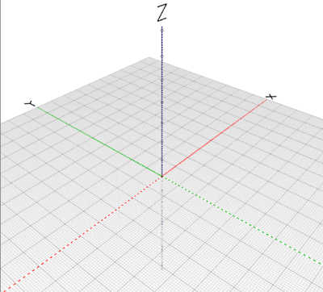

In BlocksCAD you need to work in 3 dimensions: X, Y and Z. 

If you zoom out in BlocksCAD you can see the X, Y and Z labels on the axes:

 

The X axis is the red line, the Y axis is the green line and the Z axis is the blue line (up and down.) 

The solid lines correspond to positive positions on the axes and the dashed lines correspond to negative values. 

